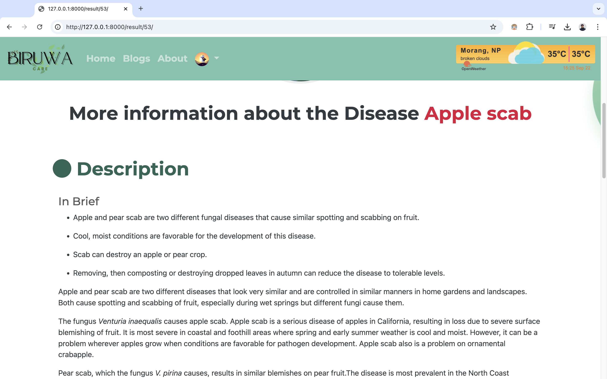

# Biruwa Care 

A web Application that uses an AI model(Machine Learning Model) to detect the disease of the plant and shows the information and solution of the disease.

## Requirements
Must install these libraries for the database to work for storing latitude and longitude.

### Install gdal and geoip
```bash
brew install gdal
```
```bash
brew install libgeoip
```

### Point to the path of the gdal and geo
`settings.py`
```GDAL_LIBRARY_PATH = os.environ.get('GDAL_LIBRARY_PATH', '/opt/homebrew/Cellar/gdal/3.9.2/lib/libgdal.dylib') 
GEOS_LIBRARY_PATH = os.environ.get('GEOS_LIBRARY_PATH', '/opt/homebrew/Cellar/geos/3.12.2/lib/libgeos_c.dylib')
```


## Screenshots




